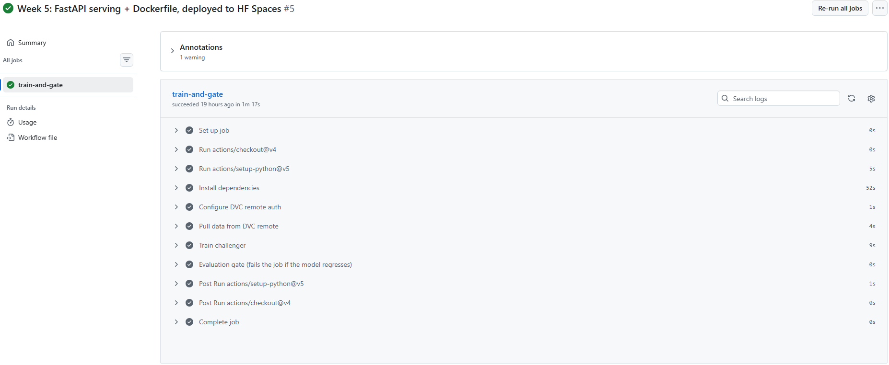
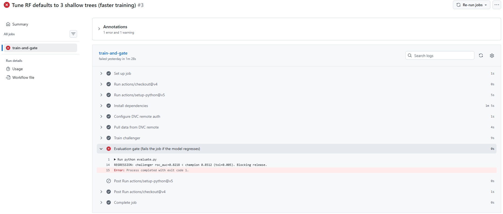
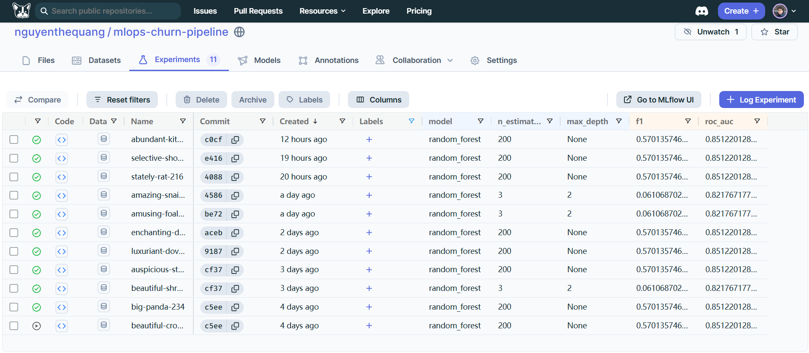
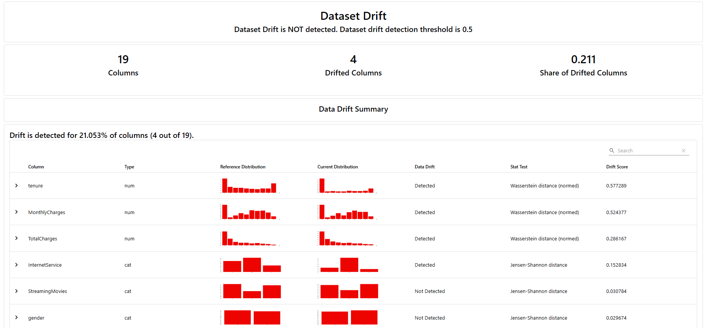

# MLOps Churn Pipeline

[](https://github.com/nguyenthequang/mlops-churn-pipeline/actions/workflows/pipeline.yml)

**Live API:** https://QuangNguyen85-churn-api.hf.space &nbsp;·&nbsp; [Interactive docs](https://QuangNguyen85-churn-api.hf.space/docs)

An end-to-end MLOps pipeline where a single `git push` triggers the full model
lifecycle: **data versioning → training → an evaluation gate that blocks
regressing models → automatic containerized deploy → drift monitoring.**

The model itself (a churn classifier on tabular data) is deliberately simple —
the **automated, monitored plumbing is the deliverable.** This repo is about
taking a model from notebook to a running, gated, monitored production system.

## Architecture

```
   git push  /  new data
            │
            ▼
   ┌──────────────┐     ┌──────────────┐     ┌─────────────────┐
   │ DVC: pull    │ ──▶ │ train.py     │ ──▶ │ evaluate.py     │
   │ data + champ │     │ (log→MLflow) │     │ GATE: chal≥champ│
   └──────────────┘     └──────────────┘     └────────┬────────┘
                                                pass  │  fail ─▶ ❌ CI stops
                                                      ▼
                                         ┌──────────────────────┐
                                         │ promote champion      │
                                         │ build + deploy API    │ ──▶ HF Space
                                         └──────────────────────┘
                                                      │
                                                      ▼
                                         ┌──────────────────────┐
                                         │ Evidently drift report│
                                         │ on each incoming batch │
                                         └──────────────────────┘
```

## Screenshots

| | |
|---|---|
|  |  |
| **CI: every push retrains + gates the model** | **The gate blocks a regressing model on a PR** |
|  |  |
| **MLflow experiment tracking (DagsHub)** | **Evidently drift report on incoming data** |

## Stack

| Concern | Tool |
|---|---|
| Data / model versioning | DVC + DagsHub remote |
| Training | scikit-learn |
| Experiment tracking | MLflow (DagsHub-hosted) |
| Evaluation gate | Plain Python, run in CI |
| CI/CD | GitHub Actions |
| Serving | FastAPI + Docker |
| Deploy target | Hugging Face Spaces (Docker SDK) |
| Drift monitoring | Evidently |

**Dataset:** Telco Customer Churn (~7,043 rows, 21 columns, binary `Churn`
target). Champion model: scikit-learn `Pipeline` (preprocessing + RandomForest),
**ROC-AUC ≈ 0.85**.

## How it works

1. **`train.py`** loads a data batch, builds a single sklearn `Pipeline` (imputation +
   one-hot encoding + RandomForest), evaluates on a holdout, writes
   `metrics/candidate.json`, and logs params/metrics/model to MLflow.
2. **`evaluate.py`** — the **gate**. Compares the challenger's ROC-AUC against the
   champion's (`metrics/champion.json`). If it regresses beyond a tolerance, it
   exits non-zero and **fails the CI job** — the bad model never ships.
3. **`promote.py`** overwrites the champion (model + metrics) and pushes it to the
   DVC remote when a challenger wins.
4. **GitHub Actions** (`.github/workflows/pipeline.yml`) runs `dvc pull → train →
   gate` on every push and pull request.
5. **`app.py`** serves the champion model as a FastAPI service, containerized and
   deployed to a Hugging Face Space.
6. **`monitor.py`** uses Evidently to compare a reference batch against incoming
   data and flag drifted features.

## Repository layout

```
train.py                 # train + log to MLflow -> candidate.json
evaluate.py              # the gate: challenger vs champion (exits non-zero on regression)
promote.py               # promote challenger -> champion (DVC)
app.py                   # FastAPI inference service
monitor.py               # Evidently data-drift report
Dockerfile               # serving image (port 7860)
requirements-serve.txt   # lean, pinned runtime deps for the image
scripts/
  make_batches.py        # split dataset into batch_0/1/2
  simulate_drift.py      # synthesize a drifted batch to demo detection
.github/workflows/
  pipeline.yml           # CI: dvc pull -> train -> gate
metrics/champion.json    # current champion's score (git-tracked)
champion/model.joblib    # current champion model (DVC-tracked)
```

## Quickstart

```powershell
python -m venv .venv
.venv\Scripts\Activate.ps1
pip install -r requirements.txt

# data (requires DVC remote access) ...
dvc pull
# ... or from scratch: drop the Kaggle CSV at data/raw/telco.csv, then:
python scripts\make_batches.py

python train.py        # train a challenger + log to MLflow
python evaluate.py     # run the gate
python monitor.py      # drift report -> drift_report.html
```

### Using the live API

```bash
curl -X POST https://QuangNguyen85-churn-api.hf.space/predict \
  -H "Content-Type: application/json" \
  -d '{"gender":"Female","SeniorCitizen":0,"Partner":"Yes","Dependents":"No","tenure":2,"PhoneService":"Yes","MultipleLines":"No","InternetService":"Fiber optic","OnlineSecurity":"No","OnlineBackup":"No","DeviceProtection":"No","TechSupport":"No","StreamingTV":"No","StreamingMovies":"No","Contract":"Month-to-month","PaperlessBilling":"Yes","PaymentMethod":"Electronic check","MonthlyCharges":70.35,"TotalCharges":140.70}'

# -> {"churn_probability":0.6,"churn":true}
```

## Design decisions

- **Champion model in DVC, champion score in git.** CI has no persistent state, so
  the reigning model + its metrics are versioned artifacts. The score lives in
  `metrics/champion.json` (git) so the gate can decide pass/fail by reading a tiny
  JSON — *without* pulling the 13 MB model. The heavy artifact is only touched on
  an actual promotion. MLflow handles experiment logging, decoupled from the gate.
- **DagsHub as the DVC remote (not Google Drive).** Free personal Google accounts
  can't back a DVC remote in 2026: interactive OAuth is blocked, and service
  accounts have no Drive storage quota (Shared Drives need paid Workspace).
  DagsHub gives token-based auth that works locally and in CI with no browser
  step, plus a hosted MLflow server.
- **Preprocessing is baked into the model.** Saving the full sklearn `Pipeline`
  (not just the estimator) means the API accepts raw customer JSON — there's no
  separate transform code to drift out of sync between training and serving.
- **A lean, pinned serving image.** The Docker image installs only
  `requirements-serve.txt` (no MLflow/DVC/Evidently), with versions pinned to the
  training environment so the pickled pipeline loads cleanly in production.
